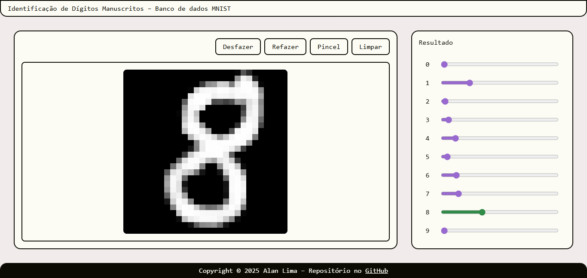

# Recognizing Handwritten Digits

This project is a simple implementation of a Neural Network to recognize handwritten digits using the MNIST dataset[^lecun;et-al]. The neural network is built from scratch in Go.

<!-- [](https://alan-b-lima.github.io/nn-digits/ui/web/dist)

The canvas for you to test your own hand (or mouse) written digits is on [GitHub Pages](https://alan-b-lima.github.io/nn-digits/ui/web/dist). -->

# The Project

The goal of this project is to learn about one of the most basic forms of neural network, as well as to train a neural network to recognize handwritten digits. To achive the latter, shall we get into some math.

## The Neural Network

The model of neural network we'll be taking a look at is my interpretation of the _Multilayer Perceptron_[^sanderson]. The Multilayer Perceptron is defined as a tuple of the so called _layers_. We shall define those first.

A layer, informally, is a group of neurons that takes an vector input and produces an vector output. The way they operate is a variation of the Pitts-McCulloch neuron[^mcculloch;pitts]. The Pitts-McCulloch neuron follow an "all-or-none" activation principle, our neurons have _activation values_ ranging over the real numbers.

### Neuron

A neuron is the smallest concernable unit of the neural network. A neuron possesses an _activation value_ $`a \in \mathbb{R}`$ _weights_ $`\mathbf{w} = (w_i)`$, $`\mathbf{w} \in \mathbb{R}^n`$, a _bias_ $`b \in \mathbb{R}`$ and an _activation function_ $`\sigma : \mathbb{R} \to \mathbb{R}`$. The activation value is computed, given input $`\mathbf{u} = (u_i)`$, $`\mathbf{u} \in \mathbb{R}^n`$:

```math
a(\mathbf{u}) = \sigma \left( b + \sum_{i = 1}^{n} {w_i u_i} \right)
```

or simply:

```math
a(\mathbf{u}) = \sigma \left( \mathbf{w} \cdot \mathbf{u} + b \right)
```

### Layer

A layer is a collection of neurons, since the activation of a single neuron can be thought of as a dot product added to a bias and passed through a activation function, the natural way to extend this idea is via matrices. A layer is a triple $`L = (\mathbf{W}, \mathbf{b}, \sigma)`$, where, for a layer with $`m`$ _input activation values_ and $`n`$ neurons:

- $`\mathbf{W} = [w_{i,j}]`$, $`\mathbf{W} \in \mathcal{M}_{n \times m} (\mathbb{R})`$, is a matrix of weights, whereas $`w_{p,q}`$ is the connection between the $`q`$-th input activation value and the $`p`$-th neuron;

- $`\mathbf{b} = [b_i]`$, $`\mathbf{b} \in \mathcal{M}_{n \times 1} (\mathbb{R})`$, is column vector of biases, whereas $`b_p`$ is the bias for the $`p`$-th neuron;

- $`\sigma : \mathbb{R} \to \mathbb{R}`$ is an activation function, we allow $`\sigma([v_{i,j}]) = [\sigma(v_{i,j})]`$.

Given an input activation vector $`\mathbf{u} = [u_i]`$, $`\mathbf{u} \in \mathcal{M}_{m \times 1} (\mathbb{R})`$, the activation of each neuron of the layer, $`\mathbf{a} = [a_i]`$, $`\mathbf{a} \in \mathcal{M}_{n \times 1} (\mathbb{R})`$, is defined:

```math
a_i(\mathbf{u}) = \sigma \left( b_{i} + \sum_{j = 1}^{m} {w_{i,j} u_j} \right)
```

or:

```math
\mathbf{a}(\mathbf{u}) = \sigma(\mathbf{W}\mathbf{u} + \mathbf{b})
```

### Neural Network

A neural network is a collection of finite ordered layers $`\mathcal{N} = (L_i)`$. Notation-wise, to reference, for example, the weight matrix of the $`L`$-th layer, we write $`\mathbf{W}^{L}`$. Note that $`m_L = n_{L - 1}`$. The _output activation vector_ of the network is $\mathbf{y} = \mathbf{a}^{|\mathcal{N}|}$, $`\mathbf{y} \in \mathcal{M}_{n_{|\mathcal{N}|} \times 1} (\mathbb{R})`$, given an input vector $`\mathbf{u} = [u_i]`$, $`\mathbf{u} \in \mathcal{M}_{m_1 \times 1} (\mathbb{R})`$, is achieved through:

```math
\begin{align*}
    a^{0}_i(\mathbf{u}) &= u_i \\
    a^L_i(\mathbf{u}) &= \sigma_L \left( b^L_{i} + \sum_{j = 1}^{m_L} {w^L_{i,j} a^{L - 1}_j(\mathbf{u})} \right) \\
\end{align*}
```

or:

```math
\begin{align*}
    \mathbf{a}^{0}(\mathbf{u}) &= \mathbf{u} \\
    \mathbf{a}^L(\mathbf{u}) &= \sigma_L(\mathbf{W}^L\mathbf{a}^{L - 1}(\mathbf{u}) + \mathbf{b}^L) \\
\end{align*}
```

We will introduce a variable $`\mathbf{z}^L = [z^L_i]`$ that represents the middle step, before the application of $`\sigma_L`$, that is:

```math
\begin{align*}
    z^L_i(\mathbf{u}) &= b^L_{i} + \sum_{j = 1}^{m_L} {w^L_{i,j} a^{L - 1}_j(\mathbf{u})} \\
    \mathbf{z}^L(\mathbf{u}) &= \mathbf{W}^L\mathbf{a}^{L - 1}(\mathbf{u}) + \mathbf{b}^L \\
\end{align*}
```

Now we may proceed to training the network.

In order to train a network, we must have an explicit way to tell how good is the network doing. We will measure it through a cost function.

### Cost Function

For a neural network $`\mathcal{N}`$, a labeled dataset $`X \subset \left\{(\mathbf{u}, \mathbf{v}) \mid \mathbf{u} \in \mathcal{M}_{m_1 \times 1} (\mathbb{R}), \mathbf{v} \in \mathcal{M}_{n_{|\mathcal{N}|} \times 1} (\mathbb{R}) \right\}`$ is given, where $`\mathbf{u}`$ is the _input_ and $`\mathbf{v} = [v_i]`$ is the _label_, i.e, the expected output, the cost function will put the input through the network and analyze it against the label.

The cost is simply the average of the error of all sample. The single sample error is given by:

```math
E(\mathcal{N}, (\mathbf{u}, \mathbf{v})) = \sum_{i = 1}^{n_{|\mathcal{N}|}} \left( y_i(\mathbf{u}) - v_i \right)^2
```

or:

```math
E(\mathcal{N}, (\mathbf{u}, \mathbf{v})) = {\left\Vert \mathbf{y}(\mathbf{u}) - \mathbf{v} \right\Vert}^2
```

Finally, the cost is calculated by:

```math
C(\mathcal{N}, X) = \frac{1}{|X|} \sum_{\mathbf{x} \in X} E(\mathcal{N}, \mathbf{x})
```

### Gradient Descent

Given a cost function, we know what to minimize. The gradient is a multidimensional derivative, if we consider a dataset $`X`$ as fixed and the weights and biases as variables (each one of them as a dimension), we can compute a vector that points in the direction of steepest ascent, negating that vector, we'll get the direction of steepest decent.

Moving in the direction of steepest decent, with certain consideration, will likely cause the cost to lower, and the network to perform better. The learning rate, $`\eta \in \mathbb{R}^{+}`$, is a parameter that tries to prevent the changes to overshoot a minima (either local or global). If $`\eta`$ is too large, the network might take too big of a step and miss a minima. This might be desirable to encounter better solutions (see Simulated Anneling), but, for now, will stick to simple descent.

At every _episode_, the dataset $`X`$ will be put though a network $`\mathcal{N}_t`$ and the gradient of the cost function, alongside a learning rate $`\eta \in \mathbb{R}^{+}`$, will compute $`\mathcal{N}_{t+1}`$[^wiki;gradient-descent]. That is:

```math
\mathcal{N}_{t+1} = \mathcal{N}_t - \eta \nabla C(\mathcal{N}_t, X)
```

The starting network $`\mathcal{N}_0`$ will simply be initialized with random real numbers. Note that we abuse notation defining the episode serie, the gradient should also range over the dataset, but here we admit the dataset is not only contant, but its dimensions do not appear in the gradient.

#### Computing the gradient

Computing the gradient is relatively easy, consider a simple network with two a layers, each one with a single neuron, $`\mathcal{N} = (([w^1], [b^1], \sigma_1), ([w^2], [b^2], \sigma_2))`$, Note that the superscripts are still identifiers of layer, not exponents. For $`\mathbf{u} = [u]`$:

```math
\begin{align*}
    \mathbf{y}
    &= \mathbf{a}^2(\mathbf{u}) \\
    &= \sigma_2(\mathbf{z}^2(\mathbf{u})) \\
    &= \sigma_2(w^2\mathbf{a}^1(\mathbf{u}) + b^2) \\
    &= \sigma_2(w^2\sigma_1(\mathbf{z}^1(\mathbf{u})) + b^2) \\
    &= \sigma_2(w^2\sigma_1(w^1\mathbf{a}^0(\mathbf{u}) + b^1) + b^2) \\
    &= \sigma_2(w^2\sigma_1(w^1\mathbf{u} + b^1) + b^2) \\
    y &= \sigma_2(w^2\sigma_1(w^1u + b^1) + b^2) \\
\end{align*}
```

using the chain rule, we get:

```math
\frac{\partial C}{\partial u} =
\frac{\partial C}{\partial a^2}
\frac{\partial a^2}{\partial z^2}
\frac{\partial z^2}{\partial a^1}
\frac{\partial a^1}{\partial z^1}
\frac{\partial z^1}{\partial u}
```

The derivative of the cost in respect to the output, $`\frac{\partial C}{\partial a^2}`$, is $`\frac{1}{|X|} \sum_{\mathbf{x} \in X} \frac{\partial E}{\partial a^2}(\mathcal{N}, \mathbf{x})`$, which all evaluated to $`\frac{1}{|X|} \sum_{(u, v) \in X} 2(y(u) - v)`$. $`\frac{\partial a^2}{\partial z^2}`$ is simply $`\sigma_2'(z^2(u))`$. And $`\frac{\partial z^2}{\partial a^1}`$ is $`w^2`$. The rest can be easily derived with the same logic.

Only the inner parts, weights and biases, have their derivatives unknown. Most of what we have done already covers what they are, the last step is given: $`\frac{\partial z^2}{\partial w^2} = a^1`$, and $`\frac{\partial z^2}{\partial b^2} = 1`$.

To obtain, for example, $`\frac{\partial C}{\partial w^1}`$, we just attach the parts we know:

```math
\frac{\partial C}{\partial a^2}
\frac{\partial a^2}{\partial z^2}
\frac{\partial z^2}{\partial a^1}
\frac{\partial a^1}{\partial z^1}
\frac{\partial z^1}{\partial w^1}
\\ =
\frac{2}{|X|} \sum_{(u, v) \in X} (y(u) - v) \cdot
\sigma_2'(z^2(u)) \cdot
w^2 \cdot
\sigma_1'(z^1(u)) \cdot
u
```

Most computations can be reused throughout the computation of the gradient, coming from the output back to the start, as if we are... backpropagating.

Now, to the last part of this section, we have to generalize what we derived to layers with multiple neurons. Just in case deriving a vector (tecnically a higher dimensional function) by another isn't clear (it is quite fuzzy, if you don't know it), we use a Jacobian matrix[^wiki;jacobian-matrix] for that. Just a refresher, let $`\mathbf{f}: \mathbb{R}^n \rightarrow \mathbb{R}^m`$, and $`\mathbf{x} = (x_i) \in \mathbb{R}^n`$, applying, we get $`\mathbf{f}(\mathbf{x}) = (f_i(\mathbf{x})) \in \mathbb{R}^m`$, the derivative $`\frac{d \mathbf{f}}{d \mathbf{x}} \in \mathcal{M}_{m \times n} (\mathbb{R}^n \rightarrow \mathbb{R})`$ is given:

```math
\frac{\partial \mathbf{f}}{\partial \mathbf{x}}
= \begin{bmatrix} \frac{\partial \mathbf{f}}{\partial x_1} & \cdots & \frac{\partial \mathbf{f}}{\partial x_n} \end{bmatrix}
= \begin{bmatrix} (\nabla f_1)^\top \\ \vdots \\ (\nabla f_n)^\top \end{bmatrix}
= \begin{bmatrix}
    \frac{\partial f_1}{\partial x_1} & \cdots & \frac{\partial f_1}{\partial x_n} \\
    \vdots & \ddots & \vdots \\
    \frac{\partial f_m}{\partial x_1} & \cdots & \frac{\partial f_m}{\partial x_n} \\
\end{bmatrix}
```

On a similar note, $`(\nabla_\mathbf{x} f)^\top = \frac{\partial f}{\partial \mathbf{x}}`$.

Now, we're trully ready, we are going to compute $`\frac{\partial C}{\partial \mathbf{u}}`$:

```math
\frac{\partial C}{\partial \mathbf{u}} =
\frac{\partial C}{\partial \mathbf{a}^{|\mathcal{N}|}} \cdot
\frac{\partial \mathbf{a}^{|\mathcal{N}|}}{\partial \mathbf{z}^{|\mathcal{N}|}} \cdot
\frac{\partial \mathbf{z}^{|\mathcal{N}|}}{\partial \mathbf{a}^{|\mathcal{N}-1|}} \cdot
\frac{\partial \mathbf{a}^{|\mathcal{N}-1|}}{\partial \mathbf{z}^{|\mathcal{N}-1|}} \cdot
\cdots \cdot
\frac{\partial \mathbf{a}^{1}}{\partial \mathbf{z}^{1}} \cdot
\frac{\partial \mathbf{z}^{1}}{\partial \mathbf{u}}
```

It seems like it should have been a little more complicated, but it isn't. Some notes are:

- operator $`\cdot`$ is, indeed, matrix multiplication;

- $`\frac{\partial C}{\partial \mathbf{a}^{|\mathcal{N}|}}`$ is a row vector, with $`\frac{\partial C}{\partial a^{|\mathcal{N}|}_i} = \left(\frac{2}{|X|} \sum_{\mathbf{x} \in X} (a^{|\mathcal{N}|}_i(u) - v)\right)`$, $`\left(\frac{\partial C}{\partial \mathbf{a}^{|\mathcal{N}|}}\right)^\top = \nabla_\mathbf{y} C`$;

- $`\frac{\partial \mathbf{a}^L}{\partial \mathbf{z}^L}`$ are diagonal matrices, having for all $`i \not= j`$, we have $`\frac{\partial a^L_i}{\partial z^L_j} = 0`$ and for all $`i`$, we have $`\frac{\partial a^L_i}{\partial z^L_i} = \sigma'_L(z^L_i)`$;

- $`\frac{\partial \mathbf{z}^L}{\partial \mathbf{a}^{L-1}} = W^L`$, because $`(\mathbf{z}^L)' = (W^L \mathbf{x} + \mathbf{b}^L)' = (W^L \mathbf{x})' = W^L`$, since matrix multiplication is linear;

- $`\frac{\partial \mathbf{z}^L}{\partial W^L}`$ is 3D matrix (using the second weight index as the third dimension), we have $`\frac{\partial z^L_i}{\partial w^L_{j,k}} = \begin{cases}a^{L-1}_k &\mid i = j \\ 0 &\mid i \not= j\end{cases}`$, which is also a diagonal matrix, if $`s \circ A_{i,j} = (sA)_{i,j}`$ was scalar-like multiplication, but for everything, it would be just $`(\mathbf{a}^{L-1})^\top \circ I_{n_L}`$; and

- $`\frac{\partial \mathbf{z}^L}{\partial \mathbf{b}^{L}} = I_{n_L}`$, an identity matrix, since they are diagonal matrices, and $`\frac{\partial z^L_i}{\partial b^L_j} = \begin{cases}1 &\mid i = j \\ 0 &\mid i \not= j\end{cases}`$.

For better representation, $`\frac{\partial \mathbf{a}^L}{\partial \mathbf{z}^L}`$ important results, the diagonal, will be made into a column vector, to better match its internal representation, this way, we swap the matrix multiplication by Hadamard product, $`\odot`$, also know as entry-wise matrix multiplication, which makes it equivalent in this case. We also drop the identity matrices for a similar reason, but the operations will still be the same.

### Backpropagation

Computing the gradient through a numerical approximation will cause every sample to be run through the network for every time we nudge a weight or bias, this is really inefficient. As it was hinted in the last subsection, we'll get around this through an algorithm called backpropagation.

Backpropagation consists of, first, a forward pass, i.e., running a sample through the network, we must also remember the middle step, $`\mathbf{z}`$, and know the derivative of the activation functions before-hand as well.

The error accumulating at each layer, $`\delta^L \in \mathcal{M}_{n_L \times 1} (\mathbb{R})`$, it's defined recursively as follows:

```math
\begin{align*}
    \delta^{|\mathcal{N}|} &= \nabla_\mathbf{y} C \odot \sigma'_{|\mathcal{N}|}(\mathbf{z}^{|\mathcal{N}|}) \\
    \delta^{L-1} &= ((W^L)^\top \cdot \delta^L) \odot \sigma'_{|\mathcal{N}|}(\mathbf{z}^{|\mathcal{N}|})
\end{align*}
```

At last, the final gradients:

```math
\begin{align*}
    \nabla_{W^L} C &= \delta^L \cdot (\mathbf{a}^{L-1})^\top \\
    \nabla_{\mathbf{b}^L} C &= \delta^L \\
\end{align*}
```

<!-- TODO: explain transpositions -->

## References

[^lecun;et-al]: LeCUN, Yann; CORTES, Corinna; BURGES; Christopher J. C. THE MNIST DATABASE of handwritten digits. **Yann LeCun ExDB MNIST**. Available in: http://yann.lecun.com/exdb/mnist/ (through the [Wayback Machine](https://web.archive.org/web/20250114200757/http://yann.lecun.com/exdb/mnist/)). Access in December 19th, 2025.

[^sanderson]: SANDERSON, Grant. NEURAL NETWORKS. **Youtube Channel 3Blue1Brown**. Available in: https://www.youtube.com/watch?v=aircAruvnKk&list=PLZHQObOWTQDNU6R1_67000Dx_ZCJB-3pi. Access in May 11th, 2025.

[^mcculloch;pitts]: McCULLOCH, Warren S.; PITTS, Walter. A LOGICAL CALCULUS OF THE IDEAS IMMANENT IN NERVOUS ACTIVITY*. **Bulletin of Mathematical Biology**. Vol. 52, No. 1/2, pp. 99-115, 1990. Available in: https://www.cs.cmu.edu/~epxing/Class/10715/reading/McCulloch.and.Pitts.pdf. Access in May 11th, 2025.

[^wiki;gradient-descent]: WIKIPEDIA. Gradient descent. **Wikipedia - The Free Encyclopedia**. Avaliable in: https://en.wikipedia.org/wiki/Gradient_descent. Access in December 19th, 2025.

[^wiki;jacobian-matrix]:  WIKIPEDIA. Jacobian matrix and determinant. **Wikipedia - The Free Encyclopedia**. Avaliable in: https://en.wikipedia.org/wiki/Jacobian_matrix_and_determinant. Access in December 28th, 2025.

[^wiki;softmax]: WIKIPEDIA. Softmax function. **Wikipedia - The Free Encyclopedia**. Avaliable in: https://en.wikipedia.org/wiki/Softmax_function. Access in December 27th, 2025.
